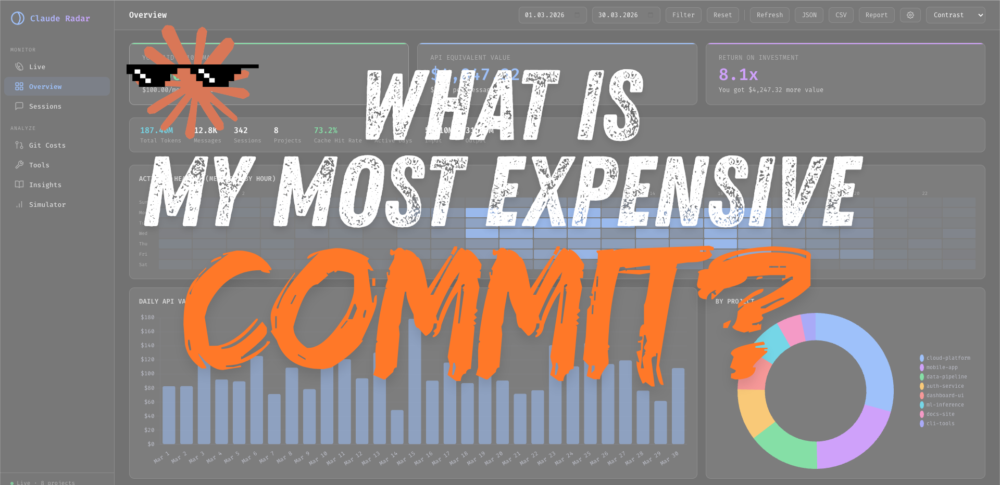
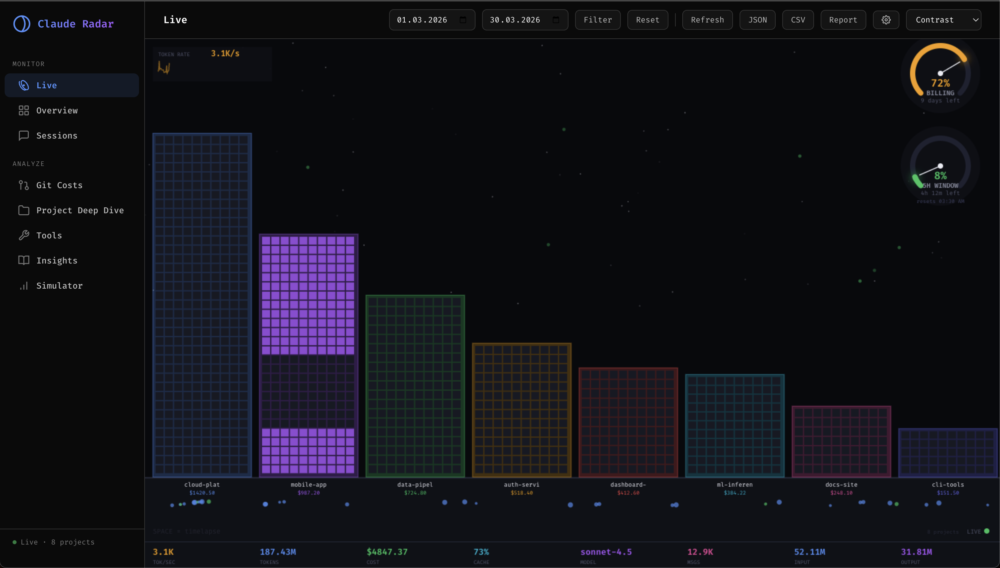
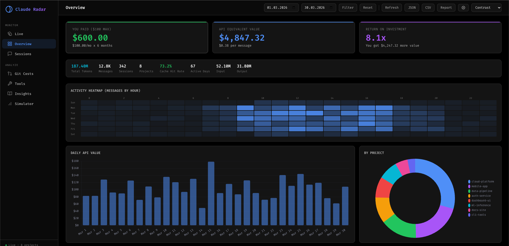
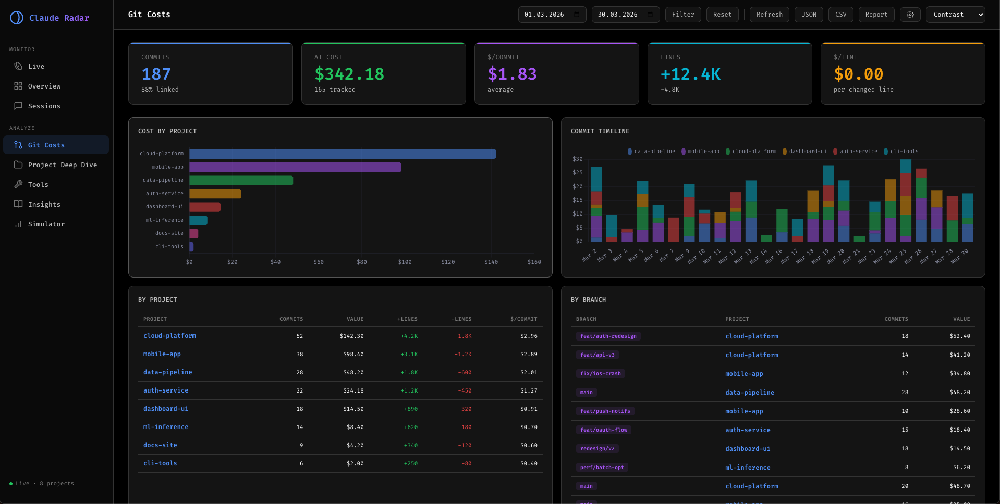
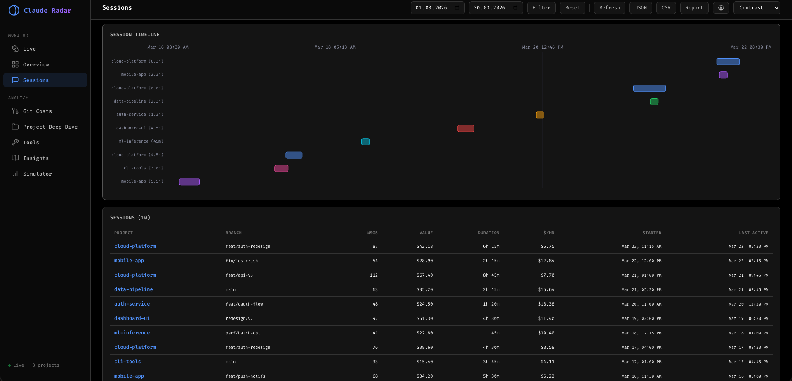
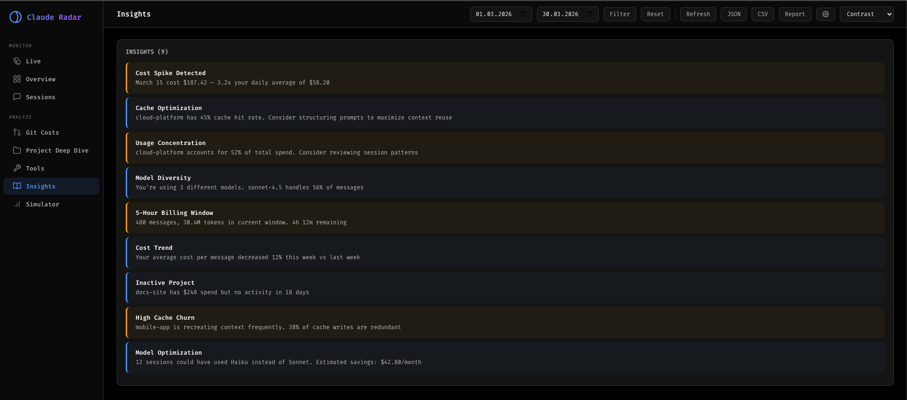
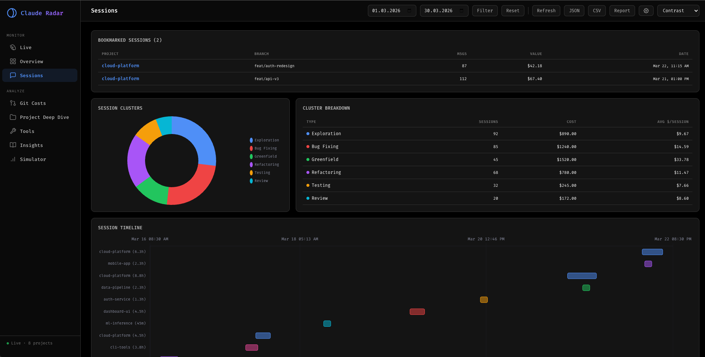

<div align="center">



# Claude Radar

[](https://www.npmjs.com/package/claude-radar) 
[]() 
[]() 
[]()

**Know exactly where your tokens go.**

Local-first dashboard for Claude Code — track token usage, costs, ROI, and git cost-per-commit across all your projects. Your data never leaves your machine.

```bash
npx claude-radar
```

</div>

## ⚡ Quick Start

```bash
npx claude-radar

# Or install globally
npm install -g claude-radar
claude-radar serve
```

Opens the dashboard at `http://localhost:3400`. First run indexes your `~/.claude/` data (~5s).

## ✨ Features

<p align="center">
  
</p>
<details>
<summary>🌃 Live Token Visualization</summary>
<br>


**Real-time canvas visualization.** Each building = a project, height = cost. Stars twinkle on cache hits, sky shifts with spend intensity. Billing gauges, token rate sparkline, and stats bar overlay.

</details>


<p align="center">
  
</p>
<details>
<summary>📊 Executive Dashboard</summary>
<br>

**Three hero KPIs (paid vs API value vs ROI), 20+ interactive charts, project/model breakdown tables, activity heatmap.** Everything you need at a glance.

</details>

<p align="center">
  
</p>
<details>
<summary>🔗 Git-to-Cost Tracking</summary>
<br>


**Every git commit mapped to its Claude session cost.** Cost per commit, per branch, per line of code. Most expensive commits ranked. Nobody else has this.

</details>


<p align="center">
  
</p>
<details>
<summary>💬 Session Browser</summary>
<br>

**Gantt timeline, efficiency grades (A-F), duration tracking, cost-per-hour.** Click any session for full message replay with token burn timeline.

</details>

<p align="center">
  
</p>
<details>
<summary>🧠 AI Insights Engine</summary>
<br>

**12 automated detection rules: cost spikes, cache efficiency, 5-hour billing window, model recommendations, usage concentration, inactive projects, and more.**

</details>

<details>
<summary>🎛️ "What If" Cost Simulator</summary>
<br>

**Interactive sliders: what if you shifted model usage? What if cache improved? See projected savings instantly.**

</details>


<details>
<summary>📅 Activity Heatmap</summary>
<br>

**GitHub-style 7×24 grid showing when you code with Claude most, by hour and day of week.**

</details>

<details>
<summary>🏷️ Session Clustering</summary>
<br>

<p align="center">
  
</p>

**Auto-classifies sessions by work type: bug fixing, exploration, greenfield, refactoring, testing, review.** Cost breakdown per type.

</details>

<details>
<summary>🔧 Tool & Subagent Analytics</summary>
<br>

**Tool usage distribution, call patterns, subagent cost tree.** See which tools Claude uses most and how subagents contribute to cost.

</details>

<details>
<summary>🤖 MCP Server</summary>
<br>

**5 tools for querying usage directly from Claude.** "How much have I spent?" "Which project costs most?" Add to settings.json and ask.

</details>

<details>
<summary>⚡ CLI Quick Stats</summary>
<br>

**`claude-radar stats` prints usage summary to terminal.** Supports `--json` for scripting. No browser needed.

</details>

<details>
<summary>🔖 Session Bookmarks</summary>
<br>

**Tag and annotate important sessions for quick access later.**

</details>

<details>
<summary>⌨️ Keyboard Shortcuts</summary>
<br>

**1-7 to switch tabs, ? for help, R to refresh.** Full keyboard navigation.

</details>

<details>
<summary>📄 Report Generator</summary>
<br>

**One-click HTML report with KPIs, project table, model breakdown, git costs, and week-over-week comparison.**

</details>

<details>
<summary>🔒 PII Redaction</summary>
<br>

**Auto-redacts API keys, tokens, JWTs, emails, IPs in message previews.** 10 pattern types.

</details>

<details>
<summary>🎨 3 Themes</summary>
<br>

**Dark (default), Light, and High Contrast.**

</details>

<details>
<summary>📡 Real-time Updates</summary>
<br>

**WebSocket watches ~/.**claude/ for changes. Dashboard updates as you code. Optional browser notifications.

</details>

<details>
<summary>📦 Export</summary>
<br>

**JSON, CSV, and HTML report exports.** All respect current date filters.

</details>

## 💻 Commands

| Command | Description |
|---------|-------------|
| `npx claude-radar` | Start dashboard (default) |
| `claude-radar stats` | Print usage summary to terminal |
| `claude-radar stats --json` | JSON output for scripting |
| `claude-radar serve -p 8080` | Custom port |
| `claude-radar serve --no-open` | Don't auto-open browser |
| `claude-radar setup` | Configure subscription plan |
| `claude-radar mcp` | Start MCP server (stdio) |

## 🤖 MCP Server

Let Claude answer questions about your usage in conversation.

Add to `~/.claude/settings.json`:

```json
{
  "mcpServers": {
    "claude-radar": {
      "command": "npx",
      "args": ["claude-radar", "mcp"]
    }
  }
}
```

Then ask: *"How much have I spent?"* · *"Which project costs most?"* · *"Am I getting good ROI?"*

## 📟 5-Hour Window Tracking

Claude Radar can show your real-time 5-hour billing window usage on the Live page.

Update your statusline in `~/.claude/settings.json` to use the Claude Radar hook:

```json
{
  "statusLine": {
    "type": "command",
    "command": "bash /path/to/claude-radar/bin/statusline-hook.sh"
  }
}
```

This captures `rate_limits.five_hour.used_percentage` and `resets_at` from Claude Code and feeds it to the dashboard gauge.

## ⚙️ How It Works

Claude Code stores detailed usage data in `~/.claude/`. Claude Radar:

1. **Indexes** JSONL files into SQLite (incremental — first run ~5s, subsequent instant)
2. **Deduplicates** by UUID (other tools overcount by ~12%)
3. **Correlates** git commits with session time ranges for cost-per-commit
4. **Serves** via Express with 25+ REST endpoints + WebSocket
5. **Watches** for changes and updates in real-time

## 🏗️ Architecture

```
~/.claude/ (read-only)          Claude Radar
┌─────────────────────┐        ┌──────────────────────────────┐
│ projects/*.jsonl     │──────▶│ SQLite Indexer (incremental)  │
│ stats-cache.json     │       │ Git Scanner (commit mapping)  │
│ history.jsonl        │       │ Express Server (25+ APIs)     │
└─────────────────────┘       │ WebSocket (live updates)      │
                               │ MCP Server (5 tools, stdio)   │
Your git repos                 └──────────┬───────────────────┘
┌─────────────────────┐                   │
│ .git/ (commit logs)  │──────▶ Dashboard (localhost:3400)
└─────────────────────┘        8 tabs · 20+ charts · 3 themes
```

## 🔐 Security

- Binds to **127.0.0.1 only** — not accessible from LAN
- Origin checking on all HTTP and WebSocket connections
- Parameterized SQL · Escaped HTML · `execFileSync` (no shell injection)
- Chart.js with SRI hash · PII auto-redacted · `npm audit`: **0 vulnerabilities**

## 📋 Requirements

- Node.js 18+
- Claude Code installed (with data in `~/.claude/`)
- Git (for commit cost tracking)

## License

MIT
